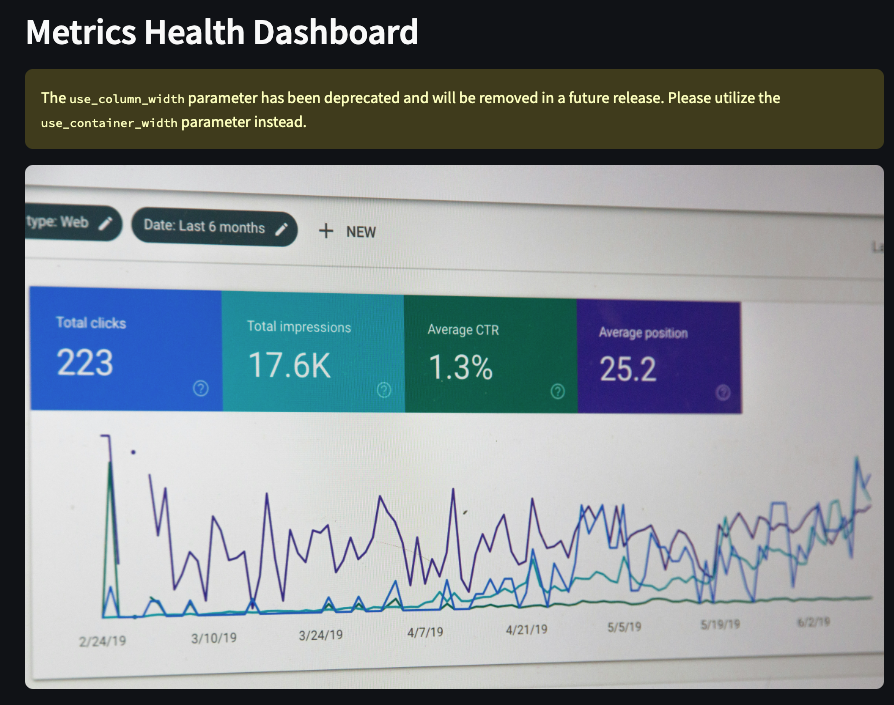

# KPI Audit Tool 📊

A sophisticated data-driven tool built with Python, Streamlit, and Plotly that helps organizations identify high-value KPIs and eliminate vanity metrics through automated scoring algorithms and interactive visualizations.

## Overview

The KPI Audit Tool analyzes your organization's metrics to identify which ones drive real business decisions and which ones might be consuming resources without providing proportionate value. It uses a multi-factor analysis approach developed for enterprise organizations to evaluate and classify metrics.



## Key Features

- **Automated Metric Classification**: Sophisticated algorithm to identify high-impact vs. vanity metrics
- **Interactive Visualizations**: Rich, interactive charts powered by Plotly
- **Department-Level Analysis**: Cross-functional metric analysis to identify silos and redundancies
- **Value Factor Analysis**: Multi-dimensional scoring based on actual usage, decision-making impact, and review frequency
- **Actionable Insights**: Clear recommendations for metric optimization
- **Data Export**: Export analysis results in CSV or Excel format

## Getting Started

1. Upload your metrics data via CSV or use the sample dataset
2. View the automated analysis across three tabs:
   - Analysis: Detailed metric evaluation and recommendations
   - Visualizations: Interactive charts and graphs
   - Metrics Details: Granular metric-level insights

## Data Format

Your CSV should include these columns:

```
Department,Metric_Name,Visible_in_Dashboard,Used_in_Decision_Making,Executive_Requested,Last_Reviewed,Metric_Last_Used_For_Decision,Interpretation_Notes
```

Sample templates are available in the tool for both full and minimal datasets.

## Key Components

- `app.py`: Main application and UI logic
- `analysis.py`: Core metric analysis algorithms
- `visualization.py`: Data visualization components
- `utils.py`: Helper functions and data preprocessing

## Technical Stack

- **Frontend**: Streamlit
- **Data Analysis**: Pandas, NumPy
- **Visualization**: Plotly Express, Plotly Graph Objects
- **Export Capabilities**: CSV, Excel

## Business Impact

- Identify metrics that truly drive business decisions
- Reduce resources spent on low-value metrics
- Improve cross-functional metric alignment
- Optimize dashboard real estate
- Drive data-driven decision making

## Example Analysis

The tool provides:
- Executive summary of metric ecosystem health
- Detailed analysis of high-impact metrics
- Identification of potential vanity metrics
- Cross-departmental metric duplication analysis
- Actionable recommendations for optimization

## Contributing

Feel free to open issues or submit pull requests. We welcome contributions to enhance the tool's capabilities.

## License

MIT License - feel free to use and modify as needed.
